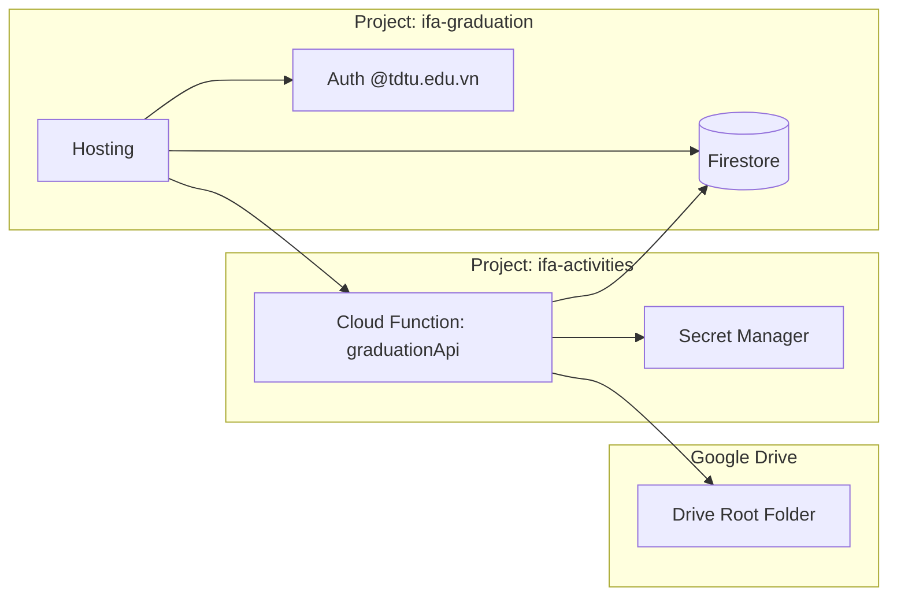

# AI / DEVELOPER HANDOFF — READ THIS BEFORE MODIFYING THE REPOSITORY

> [!IMPORTANT]
> **READ THIS BEFORE MODIFYING THE REPOSITORY**  
> Tài liệu này được biên soạn cho các AI Coding Assistant và kỹ sư phần mềm khi tiếp nhận và phát triển hệ thống IFA Graduation (Đồ án Tốt nghiệp). Hãy nắm vững các nguyên tắc và ranh giới hệ thống dưới đây trước khi sửa đổi bất kỳ tệp tin nào.

---

## 1. Source of Truth & Baseline Information

- **Repository**: `D:\CODE\IFA-GRADUATION`
- **GitHub Remote**: `https://github.com/tranquanghai-ops/IFA-GRADUATION.git`
- **Default Branch**: `main`
- **Current Production Baseline Commit**: `06a084ce1a0fdc3eba14f3cb728a46ddb610bb96`
- **Last Verified Date**: 01/10/2026

---

## 2. Production Topology & Environment



1. **Production Project**: Duy nhất **`ifa-graduation`**.
2. **Legacy Trap (`tknt-tdtu`)**: Tuyệt đối không được dùng cấu hình hay trỏ nhầm về `tknt-tdtu`. Mọi tham chiếu đến `tknt-tdtu` trong mã nguồn cũ chỉ là di sản lịch sử đã được di dời sang `ifa-graduation`.
3. **Backend Location**: `graduationApi` chạy trên **`ifa-activities`** tại `asia-southeast1`.
4. **Drive Secrets Location**: Đặt tại Secret Manager của **`ifa-activities`**.

---

## 3. Critical Invariants (Quy Tắc Bất Biến)

1. **Không hardcode Google Drive Root Folder**:
   - Thư mục gốc Google Drive là động, do Admin/Owner tự dán trong giao diện Cài đặt và được lưu trữ trong Firestore `graduationSystemConfig/drive`.
   - Tuyệt đối không lưu Root Folder ID trong Secret Manager hay mã nguồn.
2. **Không xóa vĩnh viễn tệp nộp ĐATN**:
   - Khi thay thế hoặc rút bài nộp, chỉ được sử dụng Google Drive Trash (`trashed: true`), cấm gọi lệnh DELETE vĩnh viễn.
3. **Giữ nguyên chuẩn Upload Resumable**:
   - Technical ceiling: `2 GiB`.
   - Chunk size: `32 MiB`.
   - Byte alignment: Bội số `256 KiB`.
4. **Cross-Project IAM**:
   - Service account `633545868576-compute@developer.gserviceaccount.com` bắt buộc phải có vai trò `roles/datastore.user` trên `ifa-graduation`.

---

## 4. Known Historical Traps (Các Bẫy Kỹ Thuật Lịch Sử)

- **Trap 1: Nhầm lẫn project `tknt-tdtu`**:
  - Mã nguồn ban đầu có thời điểm chứa tham chiếu `tknt-tdtu`. Toàn bộ production hiện tại đã chuyển sang `ifa-graduation`. Không bao giờ tái kích hoạt `tknt-tdtu`.
- **Trap 2: Tự ý xóa bài nộp trong Firestore**:
  - Không xóa các document trong `activitySubmissions` để tránh làm sai lệch tiến trình chấm điểm của Hội đồng và Giảng viên hướng dẫn.
- **Trap 3: Sửa nhầm API Base**:
  - Frontend gọi backend qua URL tuyệt đối đến Cloud Function `graduationApi` trên `ifa-activities`:
    `https://asia-southeast1-ifa-activities.cloudfunctions.net/graduationApi`.

---

## 5. Tests & Verification Standards

```powershell
# Kiểm tra git status
git status
git diff --check
```

---

## 6. Document Cross-Links
- [Kiến trúc hệ thống chi tiết](file:///D:/CODE/IFA-GRADUATION/docs/ARCHITECTURE.md)
- [Quản lý tệp đồ án & Google Drive](file:///D:/CODE/IFA-GRADUATION/docs/FILE-STORAGE.md)
- [Hướng dẫn triển khai production](file:///D:/CODE/IFA-GRADUATION/docs/DEPLOYMENT.md)
- [Trang thông tin tổng quan README](file:///D:/CODE/IFA-GRADUATION/README.md)
