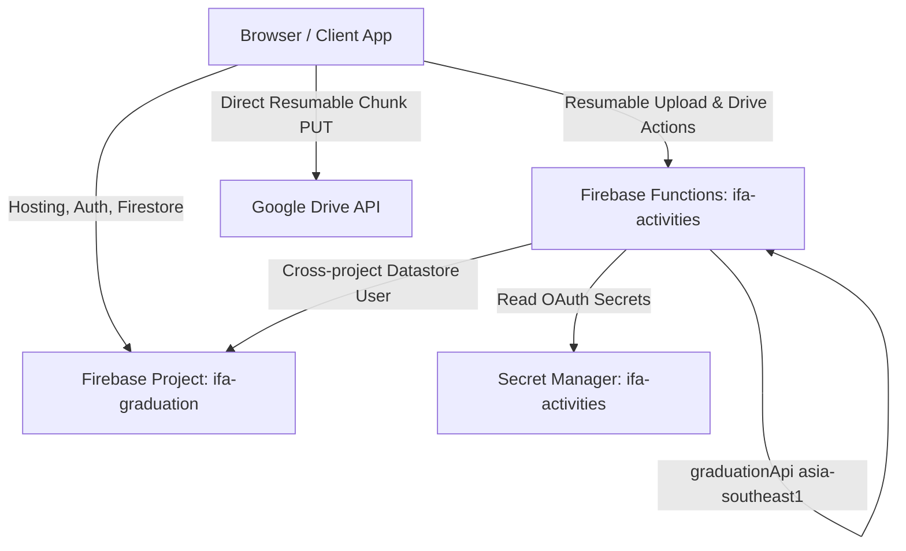

# Kiến Trúc Hệ Thống — IFA Graduation (DATN)

## 1. System Topology & Projects Overview

Hệ thống Quản lý Đồ án Tốt nghiệp (ĐATN) tuân thủ mô hình kiến trúc phân tán an toàn của hệ sinh thái IFA:



| Thành phần | Project GCP / Firebase | Ghi chú |
| :--- | :--- | :--- |
| **Hosting** | `ifa-graduation` | Site `ifa-graduation`, phục vụ SPA HTML/JS |
| **Authentication** | `ifa-graduation` | Google Auth (@tdtu.edu.vn, @student.tdtu.edu.vn) |
| **Cloud Firestore** | `ifa-graduation` | CSDL nghiệp vụ chính `(default)` |
| **Cloud Functions** | `ifa-activities` | Hàm `graduationApi` tại `asia-southeast1` |
| **Secret Manager** | `ifa-activities` | Quản lý OAuth Client ID, Secret, Owner Refresh Token |
| **Google Drive** | Managed by IFA | Thư mục root cấu hình động bởi Admin |

> [!IMPORTANT]
> **Lưu ý về tknt-tdtu**:
> Project `tknt-tdtu` là bản snapshot lịch sử / legacy backup cũ, **TUYỆT ĐỐI KHÔNG PHẢI** là production source-of-truth. Mọi dịch vụ, dữ liệu và phân quyền production đều chạy trực tiếp trên **`ifa-graduation`**.

---

## 2. Cross-Project IAM & Authentication

- **Runtime Service Account của Functions**:
  `633545868576-compute@developer.gserviceaccount.com` (chạy trên project `ifa-activities`).
- **Quyền Cross-project trên `ifa-graduation`**:
  - Vai trò: `roles/datastore.user` (Cloud Datastore User).
  - Mục đích: Cho phép backend `graduationApi` đọc và ghi dữ liệu Firestore của `ifa-graduation` (xác thực đợt tốt nghiệp, sinh viên, hoạt động mốc, cấu hình root Drive và lưu metadata bài nộp).
  - Nguyên tắc: Không cấp quyền `Owner` hay `Editor`.

---

## 3. Dynamic Google Drive Root Architecture

1. **Cấu hình Động Không Hardcode**:
   - Thư mục gốc Google Drive không được lưu cứng trong mã nguồn và không lưu trong Secret Manager.
   - Admin/Owner tự dán liên kết Google Drive Folder vào giao diện Cài đặt hệ thống.
2. **Vị trí lưu trữ**:
   - Lưu trữ tại Firestore của `ifa-graduation` trong document:
     `graduationSystemConfig/drive` (hoặc cấu hình đợt tương ứng).
   - Lưu metadata: `folderId`, `folderName`, `folderUrl`, `verifiedAt`, `canAddChildren: true`.
3. **Quy trình xác minh (Verification)**:
   - Backend gọi Google Drive API `files.get` với `supportsAllDrives=true`.
   - Tiến hành probe test tạo folder con tạm thời và xóa ngay để chứng thực quyền ghi của tài khoản OAuth (`tdtu.tknt@gmail.com`).

---

## 4. Resumable Upload Engine Specifications

- **Technical Ceiling**: `2 GiB` (2,147,483,648 bytes) cho mỗi tệp nộp.
- **Chunk Size**: `32 MiB` (33,554,432 bytes).
- **Byte Alignment**: Chuẩn bội số `256 KiB` (262,144 bytes).
- **Frontend API Base**: URL tuyệt đối đến Cloud Function:
  `https://asia-southeast1-ifa-activities.cloudfunctions.net/graduationApi`.

---

## 5. Cây Thư Mục Server-Derived & Phân Quyền Dữ Liệu

Thư mục trên Google Drive được tạo tự động bởi backend theo thứ bậc học vụ:

```text
[Root Drive Folder - Admin cấu hình]
  └── [Đợt Tốt Nghiệp / Graduation Round]
        └── [MSSV]_[Họ và Tên Sinh Viên]
              ├── [Mốc 1_Nộp Đề Tài]/
              ├── [Mốc 2_Sơ Khảo]/
              ├── [Mốc 3_Nộp ĐATN Chính Thức]/
              │     ├── 20050101_NguyenVanA_ThuyetMinh.pdf
              │     └── 20050101_NguyenVanA_BanVe.zip
              └── [Hội Đồng Chấm Thi]/
```

- **Quyền sở hữu**: Sinh viên chỉ được nộp vào đúng mốc thời gian mở của hoạt động tương ứng (`activities`).
- **An toàn tệp (Drive Trash)**: Khi sinh viên rút bài hoặc nộp thay thế phiên bản mới, hệ thống chuyển tệp cũ vào thùng rác (`trashed: true`), không xóa vĩnh viễn nhằm đảm bảo khả năng phục hồi khi có khiếu nại.

---

## 6. Collections Quan Trọng Trong Firestore

| Collection | Mục đích | Phân quyền truy cập |
| :--- | :--- | :--- |
| `graduationUsers` | Tài khoản, vai trò (Admin, GVHD, SV, Chấm thi) | Auth users |
| `graduationRounds` | Danh sách các đợt Đồ án Tốt nghiệp | Read public/auth, Write Admin |
| `graduationStudents` | Danh sách sinh viên đủ điều kiện làm ĐATN | Read SV/GVHD, Write Admin |
| `activities` | Các mốc tiến độ và nộp bài trong đợt | Read public/auth, Write Admin |
| `activitySubmissions` | Metadata các bài nộp đồ án và lịch sử | Append-only / Safe replace |
| `graduationSystemConfig` | Cấu hình hệ thống & Drive Root (`/drive`) | Read Admin, Write Owner/Admin |
| `graduationAuditLogs` | Nhật ký kiểm toán thao tác hệ thống | Immutable |
