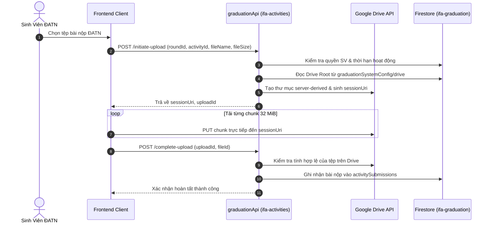

# Chính Sách & Kiến Trúc Quản Lý Tệp — IFA Graduation (DATN)

## 1. Tổng Quan Quản Lý Tệp Đồ Án Tốt Nghiệp

Hệ thống ĐATN đòi hỏi lưu trữ các tệp đồ án có dung lượng rất lớn (Thuyết minh đồ án PDF, bản vẽ CAD/PDF khổ lớn, phối cảnh 3D rendering, video thuyết trình, poster và mã nguồn/tệp nén dự án). Toàn bộ được định tuyến vào **Google Drive** của Khoa:

| Loại tệp nộp | Dung lượng tối đa | Định dạng tệp | Provider | Chính sách thay thế |
| :--- | :--- | :--- | :--- | :--- |
| **Thuyết minh ĐATN** | 500 MB (lên đến 2 GiB) | `.pdf` | Google Drive | Safe Replace / Trash cũ |
| **Bản vẽ kỹ thuật & Poster** | 1 GiB | `.pdf`, `.zip`, `.tif`, `.png` | Google Drive | Safe Replace / Trash cũ |
| **Tập tin mô hình 3D / Đồ họa** | 2 GiB | `.zip`, `.rar`, `.7z` | Google Drive | Safe Replace / Trash cũ |
| **Video trình chiếu mô hình** | 2 GiB | `.mp4`, `.mov` | Google Drive | Safe Replace / Trash cũ |
| **Phiếu đăng ký & Biểu mẫu A4** | 20 MB | `.pdf` | Google Drive / Firebase Storage | Append-only / History |

---

## 2. Thông Số Kỹ Thuật Upload Resumable

- **Technical Ceiling**: `2 GiB` (2,147,483,648 bytes).
- **Chunk Size**: `32 MiB` (33,554,432 bytes).
- **Chunk Alignment**: Bội số chính xác của `256 KiB` (262,144 bytes).
- **Chế độ nạp tiếp (Resume)**: Khi mạng chập chờn, trình duyệt truy vấn byte offset tiếp theo bằng header `Content-Range: bytes */TOTAL` và gửi tiếp các chunk còn lại mà không cần tải lại từ đầu.

---

## 3. Quy Trình Nộp Bài (Upload Flow)

---

## 4. Chính Sách Rút Bài & Thay Thế An Toàn (Safe Replace & Trash)

- **Nguyên tắc không xóa vĩnh viễn**:
  - Không bao giờ sử dụng API xóa vĩnh viễn (`DELETE /files/{fileId}`) đối với các bài nộp đồ án tốt nghiệp của sinh viên.
  - Khi sinh viên tải lên phiên bản mới trong thời gian cho phép, tệp cũ được chuyển vào Thùng rác Google Drive (`PATCH /files/{fileId}` với body `{ trashed: true }`).
- **Tương thích ngược (Backward Compatibility)**:
  - Bản ghi bài nộp trong Firestore (`activitySubmissions`) giữ liên kết tệp cũ trong mảng lịch sử `submissionHistory`, bảo đảm giảng viên và hội đồng có thể tra cứu lại các phiên bản sơ thảo trước đó.
